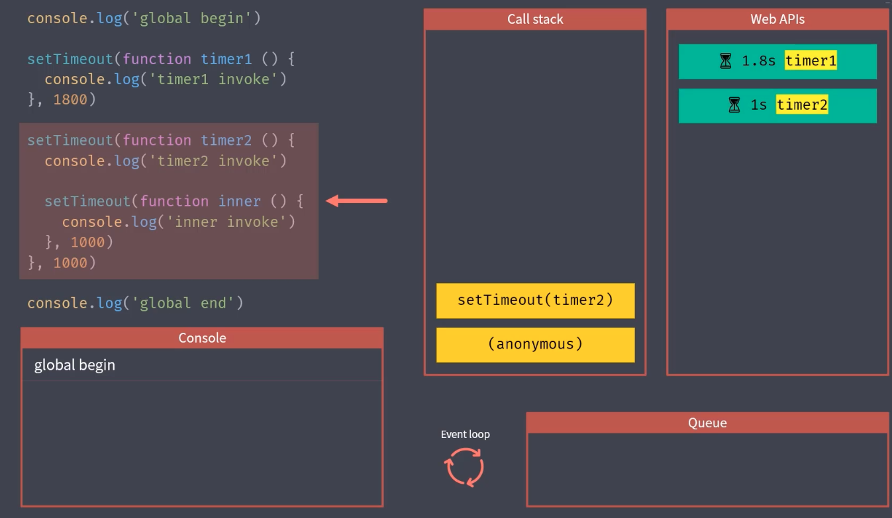

### 概述

JS 的设计初衷是一门进行网页交互的脚本语言，因为需要操作 DOM，它的代码执行被设计在单线程上工作

如果不是单线程模式，在操作 DOM 的时候势必会出现复杂的线程同步问题，当然单线程模式缺点也很明显，在同步代码执行时，遇到复杂任务时，主线程将会被阻塞，出现假死情况。

JS 通过 EventLoop（事件队列）来实现单线程模式下的异步编程

### 同步模式

同步模式很好理解，我们代码编写的顺序就是代码执行的顺序。代码执行前，JS 通过一个调用栈，按照代码编写的顺序进行压栈出栈来执行同步代码。

同步代码执行示例

```javascript
console.log('global begin'); 
function bar() {
  console.log('bar task');
} 
function foo() {
  console.log('foo task')
  bar();
}
foo();
console.log('global end');
/** 执行结果
*** global begin   console.log 压栈、出栈
*** foo task       foo 压栈 bar 压栈
*** bar task       bar 出栈， foo 出栈
*** global end     console.log 压栈、出栈
*/
```

### 异步模式

根据图片理解

- call stack 调用栈
- event-loop 消息队列
- web api ，setTimeout、ajax 请求



- 同步代码在调用栈中执行，当调用栈执行完毕之后， 消息队列会将队列中任务压入调用栈开启下一轮代码执行
- 以 setTimeout 为例，当代码遇到 setTimeout 时，浏览器首先会开启一个定时器，当等待时间结束后，会把 setTimeout 的回调函数压入消息队列，等待调用执行完毕后执行
- JS 代码是单线程执行，浏览器并不是单线程，网络请求、UI 渲染等


